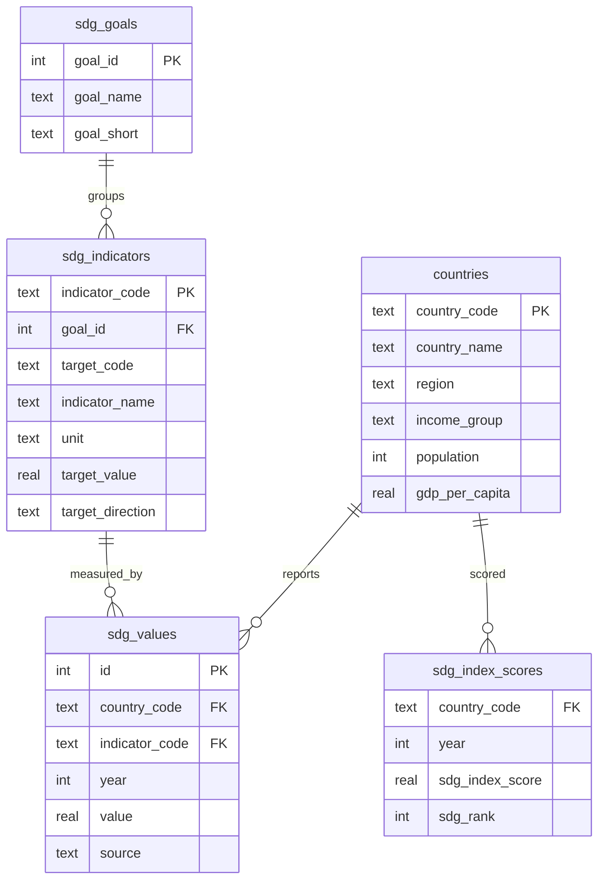

# UN SDG SQL Agent

A LangGraph agent that lets anyone ask a policy question in plain English and get a data-backed, SQL-powered answer, over a SQLite database built from UN Sustainable Development Goals data.

---

## Architecture

How a question actually flows through the agent:

1. **A local entity resolver** catches ambiguous region/country references *before* any API call — for free, since the answer is already sitting in the database
2. **A LangGraph ReAct agent** (`langgraph.prebuilt.create_react_agent`) that can inspect the schema, write SQL, run it, check the result, and retry if needed
3. **A JSONL audit log** capturing every question, every SQL query the agent tried, the raw results, the final answer, and token cost

---

## The database schema



| Table | Rows | Source |
|---|---|---|
| `countries` | 193 | SDR workbook + World Bank income classification + GDP per capita |
| `sdg_goals` | 17 | Hardcoded (the 17 UN SDGs) |
| `sdg_indicators` | 123 | SDR codebook — goal mapping, target values, improvement direction |
| `sdg_values` | 293,248 | SDR raw indicator panel, 2000–2025 |
| `sdg_index_scores` | 5,187 | SDR composite index + historical ranks, 2000–2026 |

---

## The Agent

This project uses an AI agent to query and analyze data related to the **United Nations Sustainable Development Goals (UN SDGs)** — the 17 global goals adopted by UN member states to address challenges such as poverty, health, education, inequality, and climate action.

### Why an agent, not one-shot Text-to-SQL?

Traditional Text-to-SQL systems translate a question directly into SQL:

**Question → SQL → Answer**

This can break when the first query is incorrect, the schema is complex, or answering a question requires multiple queries. An agent can instead work iteratively:

1. Inspect the database schema before writing a query
2. Generate and execute SQL
3. Examine the results
4. Detect incorrect or incomplete results
5. Revise and rerun the query when needed
6. Repeat until it has enough information to answer

This makes the workflow closer to how a human analyst would explore a database.

### Built with LangGraph

Rather than using LangChain's legacy `AgentExecutor` or `create_sql_agent`, the project is built with `langgraph.prebuilt.create_react_agent`.

The original SQL-agent approach was incompatible with current Claude models because its prompt construction could end a turn with an assistant-role message ("prefill"), which newer Claude models reject. LangGraph's native tool-calling flow avoids this issue and provides a cleaner foundation for the agent.

### Reducing Agent Cost

The initial implementation cost approximately **$0.39 per question**. After profiling agent runs and identifying unnecessary model turns, the cost was reduced to approximately **$0.06–$0.13 per question** on the same test questions, while maintaining or improving answer quality.

The main insight was that **the number of agent turns mattered more than the size of the schema or query results**. Because each turn carries the conversation history forward, unnecessary back-and-forth can quickly increase token usage.

Three changes made the biggest difference:

* **Entity resolution:** Region and country names are resolved against the existing `countries` table using `entity_resolver.py` before the question reaches the LLM. This avoids expensive trial-and-error and prompts for clarification when a name is genuinely ambiguous.
* **Cached schema:** Since the database schema does not change during a run, it is provided directly in the system prompt instead of repeatedly calling `sql_db_list_tables` and `sql_db_schema`.
* **Reasoning effort:** Lowering reasoning effort reduced tokens per turn but caused the agent to make more mistakes and require additional turns. Using `"medium"` reasoning produced a better balance between accuracy and cost.

All runs record exact token usage in `logs/agent_queries.jsonl`, so the reported costs are based on measured usage rather than estimates.

---

## Files

```
src/sql_agent.py        — agent construction, logging, token accounting
src/entity_resolver.py  — local region/country disambiguation, zero LLM calls
src/run_agent.py        — interactive CLI (python src/run_agent.py "question")
sql/01_schema.sql        — the 5-table schema
notebooks/02_database_build.ipynb — ETL: workbook + World Bank files → SQLite
logs/agent_queries.jsonl — every question, SQL, result, answer, and cost
```
