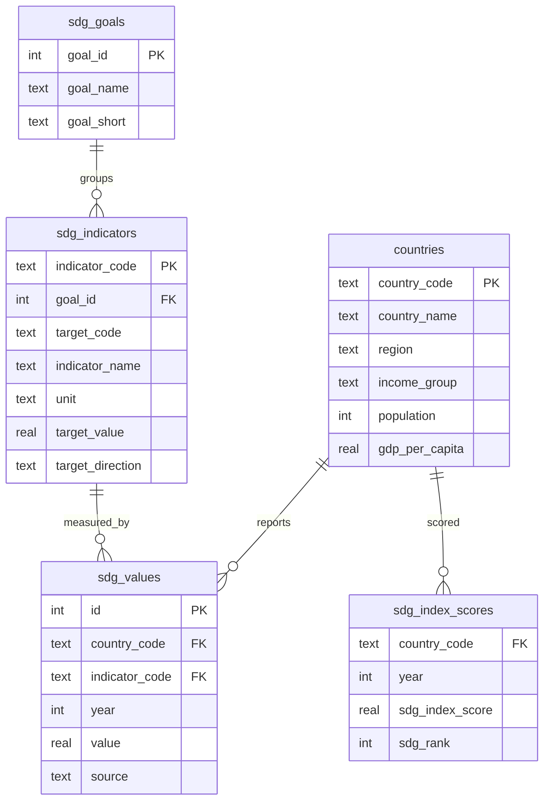

# The SDG SQL Agent

**A LangGraph agent that lets anyone ask a policy question in plain English and get a data-backed, SQL-powered answer — with its reasoning shown step by step.**

Part of the UN SDG AI Analytics Platform — the database (Layer 1) and the AI agent (Layer 2) — the part of the project that answers the users questions.

---

## Architecture

How a question actually flows through the agent:

1. **A local entity resolver** catches ambiguous region/country references *before* any API call — for free, since the answer is already sitting in the database
2. **A LangGraph ReAct agent** (`langgraph.prebuilt.create_react_agent`) that can inspect the schema, write SQL, run it, check the result, and retry if needed
3. **A JSONL audit log** capturing every question, every SQL query the agent tried, the raw results, the final answer, and token cost — a full audit trail, not just a chat transcript

---

## The database schema



| Table | Rows | Source |
|---|---|---|
| `countries` | 193 | SDR workbook + World Bank income classification + GDP per capita |
| `sdg_goals` | 17 | Hardcoded (the 17 UN SDGs) |
| `sdg_indicators` | 123 | SDR codebook — goal mapping, target values, improvement direction |
| `sdg_values` | 293,248 | SDR raw indicator panel, 2000–2025 |
| `sdg_index_scores` | 5,187 | SDR composite index + historical ranks, 2000–2026 |

---

## The agent

### Why an agent, not one-shot text-to-SQL

Text-to-SQL (schema + question → SQL, in one shot) breaks the moment the first query is wrong or the question needs more than one query to answer. An agent can:

1. Inspect the schema before writing anything (no guessing column names)
2. Write SQL, run it, and look at what came back
3. Decide the result is wrong or incomplete, and revise
4. Do this multiple times before answering — closer to how an analyst actually works

### Built on LangGraph, not LangChain's legacy `AgentExecutor`

The obvious starting point — `langchain_community.agent_toolkits.create_sql_agent` — turned out to be incompatible with current Claude models: its prompt construction can end a turn on an assistant-role message ("prefill"), a pattern Claude 4.6+/5-generation models reject outright with an HTTP 400. Rebuilt on `langgraph.prebuilt.create_react_agent`, which uses native tool-calling messages throughout and doesn't hit this. (A useful reminder that "the LangChain tutorial way" and "the way that works with this month's model" aren't always the same thing.)

### Steps to reduce the price

Firstly, chose **Claude Sonnet 5** as the model for this agent rather than Opus — at $2/$10 per million tokens versus Opus's $5/$25, it's the cheaper of Anthropic's current tiers, and a task that's mostly "read a schema, write SQL, check the result" doesn't need the most expensive model available to do it well.

Digging into the logs, the thing I assumed was driving the cost — the size of the schema and the query results — turned out to barely matter. What actually drove it was **how many back-and-forth turns the agent needed**, because every turn resends the entire conversation so far, including the model's own prior reasoning. A 12-turn run doesn't cost 12x a 1-turn run — it costs closer to 1+2+3+...+12x, because each turn carries everything before it. So the real lever was never "make each message smaller." It was "need fewer messages."

That reframed what to fix. Two things were burning extra turns on problems a person would just look up instead of guess at:

- **Region and country names.** The correct list of every region and country name already lives in the `countries` table, so there was no reason to make an LLM discover it by trial and error. I built `entity_resolver.py` to check the question against that list *before* it reaches the agent at all — plain Python, no LLM call, effectively free — and if a name is genuinely ambiguous, it asks me directly in the terminal which one I mean, instead of letting Claude quietly pick one and hope.
- **Schema lookups.** The agent was calling `sql_db_list_tables` and `sql_db_schema` at the start of nearly every run, even though the schema never changes. So I just put the schema straight into the system prompt at startup and told the agent those tools were redundant — two fewer calls per run, for nothing.

The last knob was **`reasoning_effort`** — how much the model "thinks" before acting. My first instinct was to turn it down to `"low"` for an easy win: less thinking, fewer tokens. That backfired — with less reasoning per turn, the agent got sloppier and needed *more* turns to land on a working query, which ate most of the savings right back up. Once the name-guessing problem was actually fixed rather than papered over, I moved it to `"medium"` instead: enough depth to get the query right on the first or second try, without defaulting to the most expensive thinking mode for every single step.

Altogether, cost went from **$0.39 down to roughly $0.06–0.13 per question** on the same test questions, with the same or better answer quality — none of this was a quality-for-cost tradeoff, the original cost really was waste. Every run logs its exact token count (`logs/agent_queries.jsonl`), so these are measured numbers, not estimates.

---

## Files

```
src/sql_agent.py        — agent construction, logging, token accounting
src/entity_resolver.py  — local region/country disambiguation, zero LLM calls
src/run_agent.py        — interactive CLI (python src/run_agent.py "question")
sql/01_schema.sql        — the 5-table schema
notebooks/02_database_build.ipynb — ETL: workbook + World Bank files → SQLite
logs/agent_queries.jsonl — every question, SQL, result, answer, and cost
```
